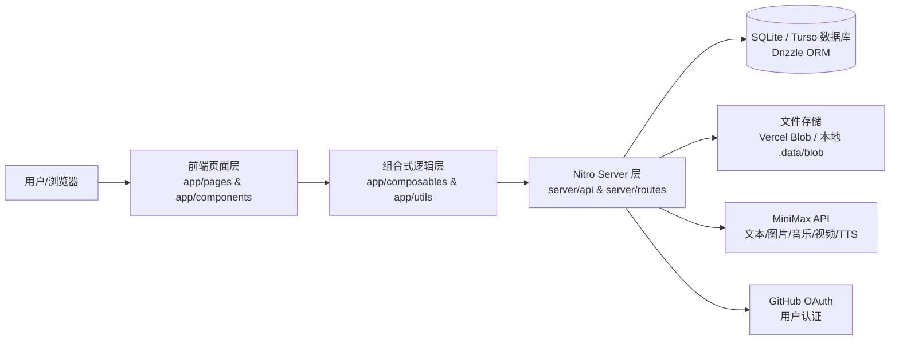

# JOSP-MiniMaxApiVue3

## 项目简介

JOSP-MiniMaxApiVue3 是一个基于 Nuxt 4 + Vue 3 + Nuxt UI 4 构建的智能对话前端应用。它提供类 ChatGPT 的交互式聊天界面，并通过 `server/api/minimax/*` 路由对接 MiniMax 大模型能力，支持文本对话、图片生成、音乐生成、视频生成和语音合成等多模态 AI 功能。项目同时内置了对话管理、GitHub OAuth 认证、文件上传与 SQLite/Turso 数据持久化能力。

## 系统架构图



## 技术栈

| 层级 | 技术 |
|------|------|
| 前端框架 | Nuxt 4 + Vue 3 + TypeScript |
| UI 组件库 | Nuxt UI 4 + Tailwind CSS 4 |
| AI SDK | Vercel AI SDK (`ai` / `@ai-sdk/vue`) + MiniMax API |
| 认证 | `nuxt-auth-utils` + GitHub OAuth |
| 数据库 | SQLite（本地）/ Turso（生产）+ Drizzle ORM |
| 文件存储 | NuxtHub Blob / Vercel Blob / 本地 `.data/blob` |
| 代码规范 | ESLint + Prettier |
| 包管理器 | pnpm |

## 项目结构

```
JOSP-MiniMaxApiVue3/
├── app/                          # 前端应用目录
│   ├── components/               # Vue 组件
│   │   ├── chat/                 # 对话相关组件
│   │   └── MiniMaxPanel.vue      # 多模态 AI 面板入口
│   ├── composables/              # 组合式函数
│   ├── layouts/                  # 布局文件
│   ├── pages/                    # 页面路由
│   │   ├── index.vue             # 首页
│   │   └── chat/[id].vue         # 对话详情页
│   └── utils/                    # 工具函数
├── server/                       # Nitro 服务端
│   ├── api/                      # API 路由
│   │   ├── chats/                # 对话 CRUD
│   │   ├── minimax/              # MiniMax 多模态代理（image/music/speech/video）
│   │   └── upload/               # 文件上传
│   ├── db/                       # Drizzle 数据库 Schema 与迁移
│   └── routes/auth/              # OAuth 认证路由
├── shared/                       # 前后端共享代码
├── assets/                       # 静态资源
├── public/                       # 公开静态文件
├── .data/                        # 本地 SQLite / Blob 数据（运行时生成）
├── nuxt.config.ts                # Nuxt 配置文件
├── package.json                  # 项目依赖与脚本
├── design.md                     # 设计系统文档
└── LICENSE                       # AGPL-3.0 开源协议
```

## 启动方式

### 1. 安装依赖

```bash
pnpm install
```

### 2. 配置环境变量

复制 `.env.example` 为 `.env`，并填写必要配置：

```bash
cp .env.example .env
```

关键变量说明：

| 变量 | 说明 |
|------|------|
| `NUXT_SESSION_PASSWORD` | `nuxt-auth-utils` 会话密钥（至少 32 位） |
| `NUXT_OAUTH_GITHUB_CLIENT_ID` | GitHub OAuth Client ID（可选） |
| `NUXT_OAUTH_GITHUB_CLIENT_SECRET` | GitHub OAuth Client Secret（可选） |
| `AI_GATEWAY_API_KEY` | Vercel AI Gateway 密钥（按需） |
| `BLOB_READ_WRITE_TOKEN` | Vercel Blob Token（可选，默认本地存储） |
| `TURSO_DATABASE_URL` / `TURSO_AUTH_TOKEN` | 生产 Turso 数据库（可选） |

### 3. 数据库迁移

```bash
pnpm db:migrate
```

### 4. 启动开发服务器

```bash
pnpm dev
```

默认访问地址：`http://localhost:3000`。

### 构建与预览

```bash
pnpm build
pnpm preview
```

## 开源协议

本项目采用 [AGPL-3.0](LICENSE) 开源协议。
